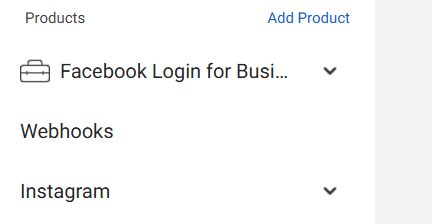

Setting Up the Post Scheduler
To successfully use this post scheduler, follow these detailed steps:

Prerequisites
Facebook Developer Account

Create or log into your Facebook Developer Account.

You will need this to set up and manage your app.

Add these products in your facebook console of your specific app - 

Facebook Page and Instagram Professional Account

Create a Facebook Page or use an existing one.

Convert your Instagram account to a Professional Account (Creator or Business).

Link your Instagram account to your Facebook Page under Settings > Linked Accounts.

Setting Up Test Users

In your Facebook Developer Console:

Add test users to your app.

Include the Instagram account you linked to the Facebook Page as a test user.

Go to the Instagram account and approve the app request.

Granting API Permissions

Navigate to the Graph API Explorer in the Developer Console.

Add the following permissions to your app:

read_insights

pages_show_list

business_management

instagram_basic

instagram_manage_comments

instagram_manage_insights

instagram_content_publish

instagram_manage_messages

pages_read_engagement

pages_read_user_content

pages_manage_posts

Ensure all permissions are granted and approved during the app review process.

Getting Instagram User ID and Facebook Page ID

Follow this YouTube tutorial for a step-by-step guide on retrieving your Instagram User ID and Facebook Page ID.

AWS Setup
AWS Account

Create an AWS account if you don’t already have one.

AWS S3 Bucket

Create an S3 Bucket for storing media files or other assets.

AWS Credentials

Obtain your AWS Access Key ID and AWS Secret Access Key from the AWS IAM service.

Store these securely in the .env file (explained below).

Configuring Environment Variables
In the root of your project directory, create a .env file and populate it with the required values. Below are the keys you'll need:

```bash
NEXT_PUBLIC_APP_CLIENT_ID=your-facebook-app-client-id
NEXT_PUBLIC_INSTAGRAM_CLIENT_SECRET=your-instagram-client-secret
NEXT_PUBLIC_INSTAGRAM_REDIRECT_URI=your-instagram-redirect-uri
INSTAGRAM_VERIFY_TOKEN=your-verify-token
NEXT_PUBLIC_META_ACCESS_TOKEN=your-meta-access-token
NEXT_PUBLIC_INSTAGRAM_PROFILE_ID=your-instagram-profile-id
NEXT_PUBLIC_FACEBOOK_PAGE_ID=your-facebook-page-id
NEXT_PUBLIC_AWS_REGION=your-aws-region
NEXT_PUBLIC_AWS_ACCESS_KEY_ID=your-aws-access-key-id
NEXT_PUBLIC_AWS_SECRET_ACCESS_KEY=your-aws-secret-access-key
NEXT_PUBLIC_AWS_BUCKET_NAME=your-aws-bucket-name
MONGODB_URI=your-mongodb-uri
NODE_ENV=your-node-environment
JWT_SECRET=your-jwt-secret
REFRESH_TOKEN_SECRET=your-refresh-token-secret
```
Running the Project
Install dependencies:

```bash
npm install
```
```bash
npm run dev
```

